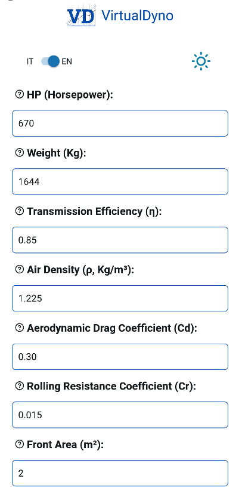
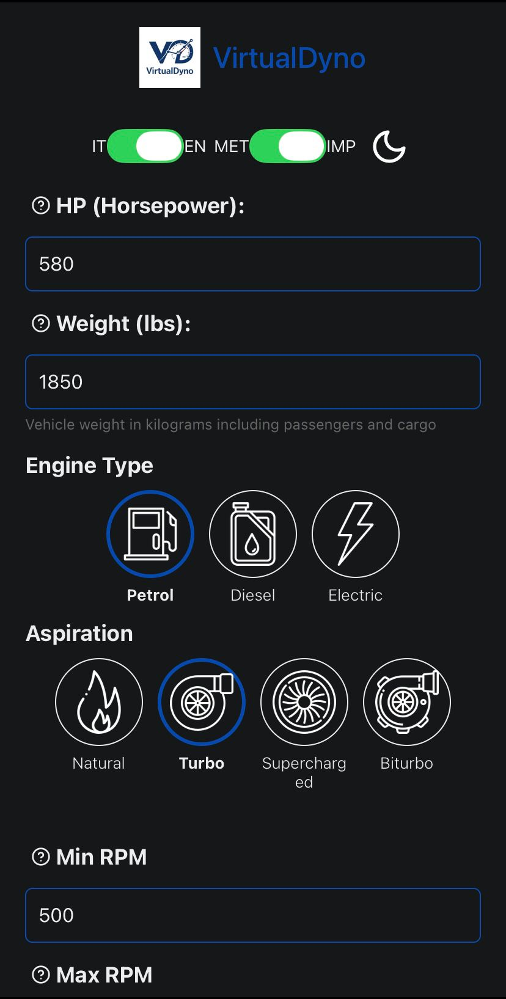
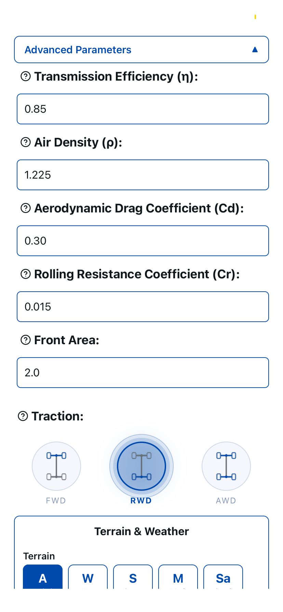
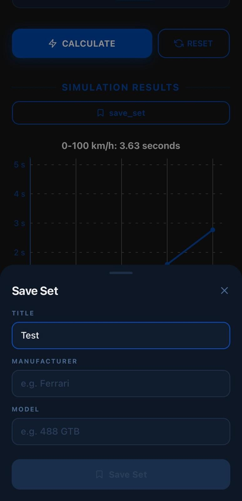
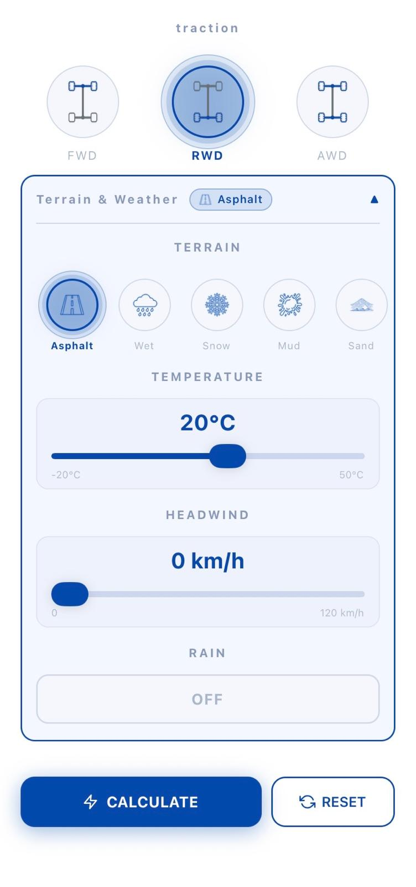
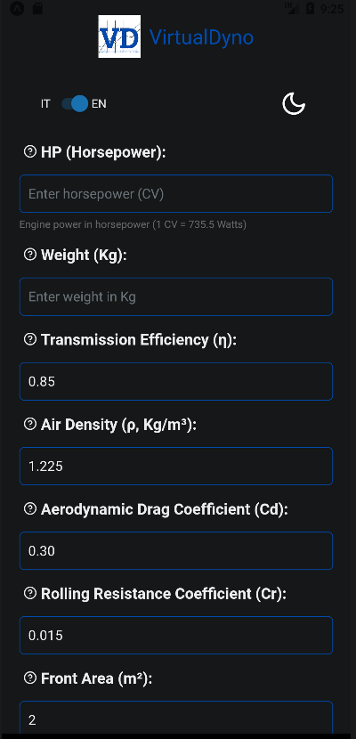
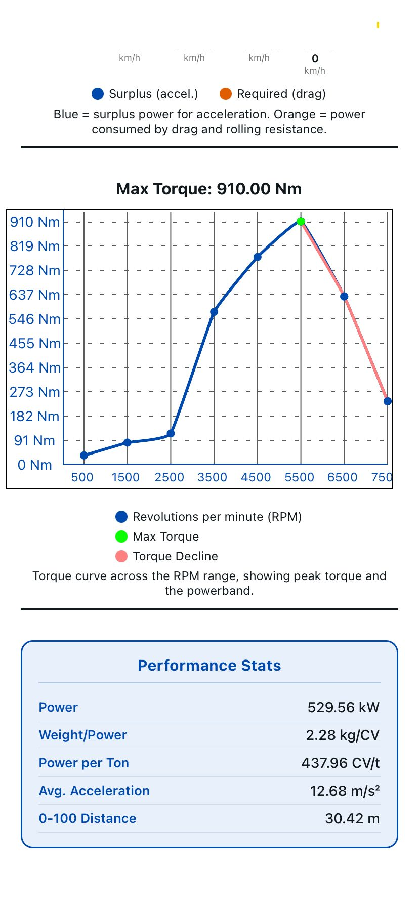
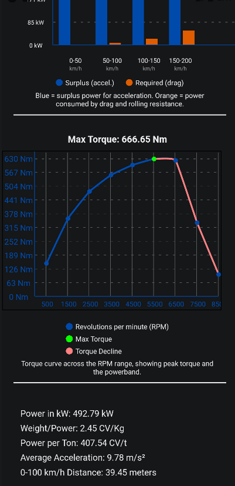
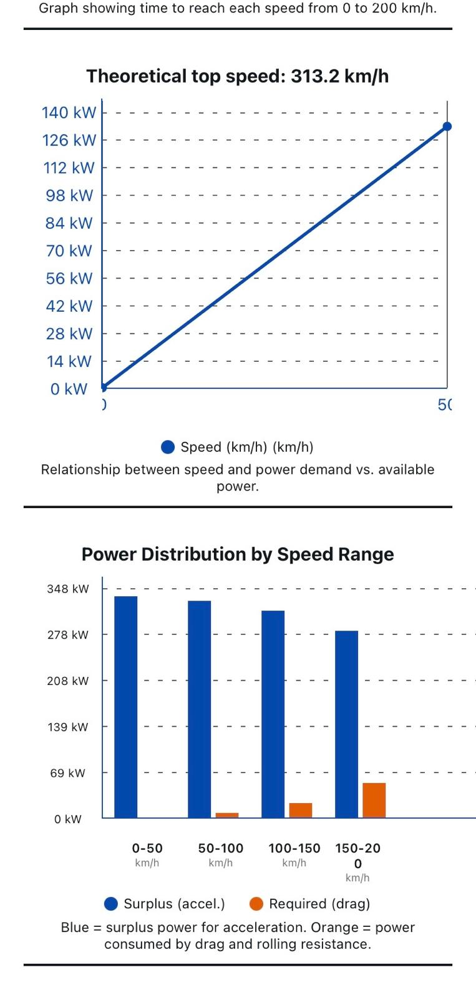
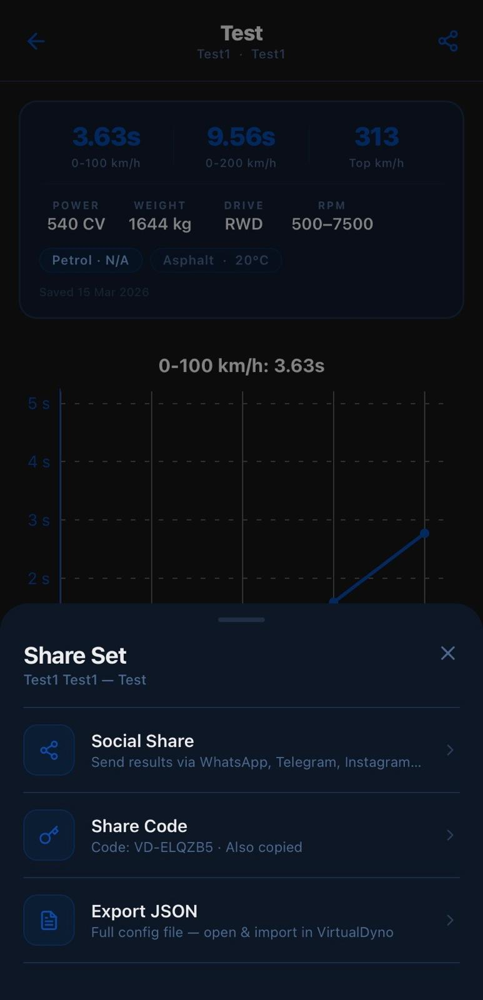

#  VirtualDyno


> A physics-based vehicle performance simulator for mobile. No dyno required.

---

## Screenshots

| Light            | Dark             |
|------------------|------------------|
|   |  |
|  |  |
|  |  |
|  |  |
|  |  |

---

# 🇬🇧 English

## What is VirtualDyno?

VirtualDyno is an open-source mobile app that simulates vehicle performance from a set of physical parameters — power, weight, aerodynamics, engine type, aspiration mode, drivetrain type, terrain, and weather. It gives you 0–100 km/h and 0–200 km/h times, theoretical top speed, a torque curve, and a power distribution analysis across speed bands — all without needing access to a physical dynamometer.

The physics model is empirically calibrated against data from multiple reliable sources across a wide range of vehicles, from everyday hatchbacks to high-performance supercars. The formulas are documented in the source code and designed to stay interpretable without sacrificing accuracy.

## Features

- **0–100 km/h (0–62 mph)** time with animated speed-time chart
- **0–200 km/h (0–124 mph)** time with monotonic curve interpolation — no dip artifacts
- **Theoretical top speed** via binary search with calibrated drivetrain loss factor
- **Torque curve** across the full RPM range, with engine-type-specific models
- **Power distribution chart** — surplus vs. required power across speed bands
- **Engine types** — Petrol, Diesel, Electric with dedicated physics defaults and torque curves
- **Aspiration modes** — Natural, Turbo (with lag model), Supercharger, Biturbo
- **Terrain & weather simulation** — asphalt, wet, snow, mud, sand; temperature, headwind, rain — collapsible panel with image-based terrain selector and active-state badge
- **Traction type** — FWD, RWD, AWD with calibrated grip penalties
- **Advanced parameters accordion** — efficiency, air density, Cd, Cr, frontal area
- **Metric / Imperial toggle** — full conversion across all inputs, outputs, and chart axes
- **English / Italian** language switch
- **Light / Dark theme**
- **Haptic feedback** — selection, impact, and error vibrations across all interactive elements
- **Garage** — save, browse, edit, and delete vehicle sets with full chart replay
- **Share & Import** — three sharing modes (Social, Code, JSON) and two import methods (code paste, file picker)

## Physics model

| Output | Method |
|--------|--------|
| 0–100 time | Empirical: `t = v/a` at v = 100 km/h, net force from `P·η/v − F_aero − F_roll` |
| 0–200 time | Calibrated scaler: `t200 = t100 × clamp(1.9516 + 0.2082/(cv/kg), 2.1, 3.8)` |
| 0–200 graph | Monotonic sqrt interpolation anchored on exact t100 / t200 values |
| Top speed | Binary search on `F_engine − F_drag − F_rolling = 0` |
| Torque (ICE) | Exponential rise + Gaussian decay, peak RPM scaled by power class |
| Torque (EV) | 3-phase: flat peak → linear drop → field weakening |
| Diesel penalty | ×1.06 on 0–100, ×1.09 on 0–200 |
| Turbo lag | Boost threshold 2200 RPM (biturbo: 2800), pre-boost torque at 28% / 22% of peak |
| Aspiration | Per-mode multipliers on t100 / t200 and torque peak |
| Traction | Calibrated time penalty per drivetrain type |
| Terrain / weather | Post-multiplier: grip factor, temperature/density correction, headwind, rain |

## Technologies

| Library | Purpose |
|---------|---------|
| React Native + Expo | Mobile framework |
| TypeScript | Type safety |
| react-i18next | Internationalisation (EN / IT) |
| react-native-gifted-charts | Line charts and bar charts |
| @react-native-community/slider | Terrain & weather sliders |
| react-native-reanimated | Animations |
| expo-haptics | Haptic feedback |
| @react-native-async-storage/async-storage | Garage local persistence |
| expo-sharing | JSON file export |
| expo-file-system | File read/write for import/export |
| expo-clipboard | Copy share code to clipboard |
| expo-document-picker | JSON file import picker |

## Installation

```sh
git clone https://github.com/DevFoxxx/VirtualDyno.git
cd VirtualDyno
npm install
npx expo install @react-native-community/slider
npx expo install @react-native-async-storage/async-storage
npx expo install expo-sharing expo-file-system expo-clipboard expo-document-picker
npx expo start
```

Scan the QR code with Expo Go on Android or iOS, or press `a` for an Android emulator.

## Project structure

```
app/
  (tabs)/
    index.tsx                  # Main screen — all state, physics, layout

components/
  AdditionalStats.tsx          # Derived stats (kW, kg/CV, CV/t, distance…)
  EngineTypePicker.tsx         # Engine type + aspiration selector with i18n
  GarageCard.tsx               # Single saved-set card (list view)
  GarageDetailScreen.tsx       # Full detail view: summary + all charts + share
  GarageScreen.tsx             # Garage list screen with FAB import button
  ImportModal.tsx              # Import modal: code tab + JSON file tab
  MaxTorqueChart.tsx           # RPM vs torque line chart
  PowerDistributionChart.tsx   # Grouped bar chart by speed band
  SaveSetModal.tsx             # Bottom sheet to save or edit a set
  ShareModal.tsx               # Share bottom sheet: Social / Code / JSON
  TerrainWeatherPicker.tsx     # Collapsible terrain + weather panel
  TheoreticalTopSpeed.tsx      # Power available vs required chart
  TractionPicker.tsx           # FWD / RWD / AWD icon selector
  shareUtils.ts                # encode/decode share code, export/import JSON
  useGarage.ts                 # CRUD hook for AsyncStorage garage

i18n/
  en.json                      # English translations
  it.json                      # Italian translations

assets/
  images/
    asphalt.png                # Terrain icons
    wet.png
    snow.png
    mud.png
    sand.png
    petrol.png                 # Engine type icons
    diesel.png
    electric.png
    natural.png                # Aspiration icons
    turbo.png
    supercharger.png
    biturbo.png
    FWD.png                    # Traction icons
    RWD.png
    AWD.png
```

## Garage & sharing

### Garage

The Garage stores vehicle sets locally using AsyncStorage. Each set captures the full input configuration, weather conditions, and results. Saved sets can be browsed from the main screen via the **Garage** button in the header.

- Tap a card to open its full detail view with all charts replayed from saved data
- Edit icon (✏️) — rename title, manufacturer, or model; a grey *edited* label appears after any update
- Trash icon (🗑) — delete with confirmation alert
- FAB (⬇) — opens the Import modal

### Share & Import

From any set's detail screen, tap the **share icon** (↗) to open a bottom sheet with three options:

| Option | What it does |
|--------|-------------|
| **Social Share** | Formatted text with key results + import code — share via WhatsApp, Telegram, etc. |
| **Share Code** | Generates a `VD-XXXXXX-…` code, copies it to clipboard, and opens the system share sheet |
| **Export JSON** | Creates a lightweight `.json` file (~2 KB, inputs only) and shares it via the system share sheet |

To import a set, tap the **FAB (⬇)** in the Garage screen:

| Tab | How to use |
|-----|-----------|
| **Enter Code** | Paste the full `VD-XXXXXX-…` code received from another user |
| **Open File** | Pick a `.json` file exported from VirtualDyno |

> Imported sets store input parameters only. Charts are recalculated on the device at import time — no stale graph data is carried over.

## Unit system

All internal calculations use the metric system. When the **IMP** toggle is active, conversions are applied at display time across every input, output, and chart axis:

| Metric | Imperial |
|--------|----------|
| km/h | mph |
| kg | lbs |
| kW | hp |
| Nm | lb·ft |
| m² | ft² |
| kg/m³ | lb/ft³ |
| °C | °F |

## Contributing

Pull requests are welcome. The areas most open to contribution are:

1. **Physics improvements** — torque-curve-based numerical integration for more accurate intermediate times
2. **UI / UX** — layout polish, chart label alignment (see open issues)
3. **New vehicle profiles** — preset configurations for common cars
4. **Translations** — additional languages beyond EN / IT
5. **Bug fixes** — check the [Issues](https://github.com/DevFoxxx/VirtualDyno/issues) tab

Please open an issue before starting significant work so we can coordinate.

## License

The source code is available for review and contributions.  
Commercial use, redistribution, and derivative works are not permitted  
without the author's explicit written permission. See [LICENSE](https://github.com/DevFoxxx/VirtualDyno/blob/main/LICENSE).

---

# 🇮🇹 Italiano

## Cos'è VirtualDyno?

VirtualDyno è un'app mobile open-source che simula le prestazioni di un veicolo a partire da parametri fisici — potenza, peso, aerodinamica, tipo di motore, modalità di aspirazione, tipo di trazione, fondo stradale e condizioni meteo. Fornisce i tempi 0–100 km/h e 0–200 km/h, la velocità massima teorica, la curva di coppia e un'analisi della distribuzione della potenza per fasce di velocità, senza bisogno di un banco prova fisico.

Il modello fisico è calibrato empiricamente su dati provenienti da diverse fonti affidabili, su un ampio numero di vetture che spaziano dalle citycar alle supercar ad alte prestazioni. Le formule sono documentate nel codice sorgente e progettate per restare leggibili senza sacrificare la precisione.

## Funzionalità

- **0–100 km/h** con grafico velocità-tempo animato
- **0–200 km/h** con interpolazione monotona della curva — nessun artefatto di discesa
- **Velocità massima teorica** tramite ricerca binaria con fattore di perdita calibrato
- **Curva di coppia** sull'intero range RPM, con modelli specifici per tipo di motore
- **Grafico distribuzione potenza** — potenza residua vs. richiesta per fasce di velocità
- **Tipo di motore** — Benzina, Diesel, Elettrico con defaults fisici e curve di coppia dedicate
- **Modalità di aspirazione** — Naturale, Turbo (con modello lag), Compressore, Biturbo
- **Simulazione fondo & meteo** — asfalto, bagnato, neve, fango, sabbia; temperatura, vento, pioggia — pannello collassabile con selettore fondo basato su icone e badge di stato attivo
- **Tipo di trazione** — FWD, RWD, AWD con penalità di aderenza calibrate
- **Accordion parametri avanzati** — efficienza, densità aria, Cd, Cr, area frontale
- **Toggle Metrico / Imperiale** — conversione completa su input, output e assi dei grafici
- **Lingua inglese / italiana**
- **Tema chiaro / scuro**
- **Feedback aptico** — vibrazione di selezione, impatto ed errore su tutti gli elementi interattivi
- **Garage** — salva, sfoglia, modifica ed elimina set con riesecuzione completa dei grafici
- **Condivisione & Import** — tre modalità di condivisione (Social, Codice, JSON) e due metodi di import (codice, file)

## Modello fisico

| Output | Metodo |
|--------|--------|
| 0–100 km/h | Empirica: `t = v/a` a v = 100 km/h, forza netta da `P·η/v − F_aero − F_roll` |
| 0–200 km/h | Scaler calibrato: `t200 = t100 × clamp(1.9516 + 0.2082/(cv/kg), 2.1, 3.8)` |
| Grafico 0–200 | Interpolazione sqrt monotona ancorata su t100 / t200 esatti |
| Velocità max | Ricerca binaria su `F_motore − F_drag − F_rolling = 0` |
| Coppia (ICE) | Salita esponenziale + decadimento gaussiano, picco scalato per classe di potenza |
| Coppia (EV) | 3 fasi: picco piatto → calo lineare → indebolimento di campo |
| Penalità diesel | ×1.06 su 0–100, ×1.09 su 0–200 |
| Turbo lag | Soglia boost 2200 RPM (biturbo: 2800), pre-boost al 28% / 22% del picco |
| Aspirazione | Moltiplicatori per modalità su t100 / t200 e picco di coppia |
| Trazione | Penalità sul tempo calibrata per tipo di trazione |
| Fondo / meteo | Post-moltiplicatore: grip, correzione temperatura/densità, vento, pioggia |

## Tecnologie

| Libreria | Scopo |
|---------|-------|
| React Native + Expo | Framework mobile |
| TypeScript | Tipizzazione |
| react-i18next | Internazionalizzazione (EN / IT) |
| react-native-gifted-charts | Grafici a linee e a barre |
| @react-native-community/slider | Slider per fondo e meteo |
| react-native-reanimated | Animazioni |
| expo-haptics | Feedback aptico |
| @react-native-async-storage/async-storage | Persistenza locale Garage |
| expo-sharing | Export file JSON |
| expo-file-system | Lettura/scrittura file per import/export |
| expo-clipboard | Copia codice di condivisione negli appunti |
| expo-document-picker | Selettore file per import JSON |

## Installazione

```sh
git clone https://github.com/DevFoxxx/VirtualDyno.git
cd VirtualDyno
npm install
npx expo install @react-native-community/slider
npx expo install @react-native-async-storage/async-storage
npx expo install expo-sharing expo-file-system expo-clipboard expo-document-picker
npx expo start
```

Scansiona il QR code con Expo Go su Android o iOS, oppure premi `a` per un emulatore Android.

## Garage e condivisione

### Garage

Il Garage salva i set localmente tramite AsyncStorage. Ogni set contiene la configurazione completa degli input, le condizioni meteo e i risultati. I set salvati sono accessibili dalla schermata principale tramite il bottone **Garage** nell'header.

- Tocca una card per aprire la vista dettaglio completa con tutti i grafici ricostruiti dai dati salvati
- Icona ✏️ — rinomina titolo, casa automobilistica o modello; dopo ogni modifica compare la scritta *edited* in grigio
- Icona 🗑 — elimina con alert di conferma
- FAB ⬇ — apre il modal di import

### Condivisione & Import

Dalla vista dettaglio di un set, tocca l'**icona di condivisione** (↗) per aprire un bottom sheet con tre opzioni:

| Opzione | Cosa fa |
|---------|---------|
| **Social Share** | Testo formattato con i risultati chiave + codice di import — condivisibile via WhatsApp, Telegram, ecc. |
| **Share Code** | Genera un codice `VD-XXXXXX-…`, lo copia negli appunti e apre il sistema di condivisione nativo |
| **Export JSON** | Crea un file `.json` leggero (~2 KB, solo input) e lo condivide tramite il sistema nativo |

Per importare un set, tocca il **FAB (⬇)** nella schermata Garage:

| Tab | Come si usa |
|-----|-------------|
| **Enter Code** | Incolla il codice completo `VD-XXXXXX-…` ricevuto da un altro utente |
| **Open File** | Seleziona un file `.json` esportato da VirtualDyno |

> I set importati contengono solo i parametri di input. I grafici vengono ricalcolati sul dispositivo al momento dell'import.

## Sistema di unità

Tutti i calcoli interni usano il sistema metrico. Quando il toggle **IMP** è attivo, le conversioni vengono applicate al momento della visualizzazione su ogni input, output e asse dei grafici.

## Contributi

Le pull request sono benvenute. Le aree più aperte ai contributi sono:

1. **Miglioramenti fisici** — integrazione numerica basata sulla curva di coppia per tempi più precisi
2. **UI / UX** — rifinitura del layout, allineamento etichette grafici (vedi issues aperti)
3. **Profili veicolo preimpostati** — configurazioni per auto comuni
4. **Traduzioni** — lingue aggiuntive oltre a EN / IT
5. **Bug fix** — controlla la sezione [Issues](https://github.com/DevFoxxx/VirtualDyno/issues)

Apri un issue prima di iniziare un lavoro significativo, così possiamo coordinarci.

## Licenza

Il codice sorgente è disponibile per consultazione e contribuzione.  
Uso commerciale, ridistribuzione e opere derivate non sono permessi  
senza autorizzazione scritta esplicita dell'autore. Vedi [LICENSE](https://github.com/DevFoxxx/VirtualDyno/blob/main/LICENSE).
