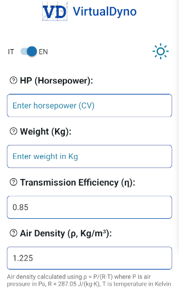
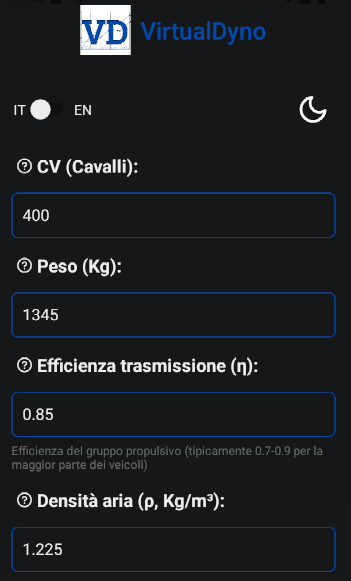
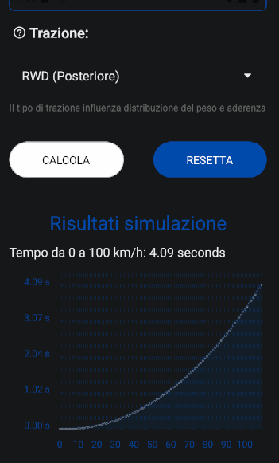

#  
# VirtualDyno

  

This application is in its early stages and is continuously being developed. It will be regularly updated, both functionally and visually. Consider the current content as the initial phase.

## Screenshot (development phase, light/dark theme)
 


# 🇬🇧 EN 
## Description
VirtualDyno is an advanced application designed to calculate and analyze vehicle performance using parameters such as power, weight, aerodynamic coefficient, and traction. With this data, it is possible to accurately estimate the 0-100 km/h acceleration time, specific power, average acceleration, and other key indicators to deeply understand a vehicle's dynamics. The primary goal of VirtualDyno is to provide a powerful yet easily accessible simulation tool for both hobbyists and professionals in the automotive sector, such as engineers and performance testers.

Being open-source, the software offers the possibility to be customized and improved by the community. Developers can contribute to the app's evolution, adding new features and tailoring it to specific needs. Users, therefore, benefit from an always-updated tool that meets various requirements. VirtualDyno is perfect for car enthusiasts, drivers, research and development teams, and automotive industry professionals who want to test and compare vehicles without the need for physical test benches. The interface is simple and intuitive, yet powerful, offering quick and accurate simulations.

The open-source approach and continuous evolution of the software make VirtualDyno an essential resource for anyone looking to explore vehicle performance in an economical, precise, and innovative way.

One of the most interesting aspects of VirtualDyno is its ability to find physical formulas that adapt to reality, without making the model too complex or unrealistic. The app stands out for its balance between precision and simplicity, offering reliable simulations without overwhelming the user with too many variables or mathematical complexities, making it a practical and accessible tool for everyone.

## Features
- Insert main vehicle data (CV, weight, efficiency, air density, Cd, Cr, frontal area, traction)
- Calculate vehicle performance
- Switch between Italian and English language
- Performance chart (under development)

## Technologies used
- **React Native** for mobile development
- **React Native Picker** for traction selection
- **react-i18next** for language management
- **react-native-chart-kit** for data visualization (in the future)

## Installation
1. Clone the repository:
```sh
git clone https://github.com/DevFoxxx/VirtualDyno.git
cd VirtualDyno
```
2. Install dependencies:
```sh
npm install
```
3. Run the app with Expo:
```sh
npx expo start
```
4. Choose to run the app on your Android emulator or a real device directly from the Expo developer tools.

## Available Translations
- Italian
- English

## Upcoming Developments
1. 0-200 Km/h time + graph
2. Power distribution analysis across different speed ranges
3. Performance simulation on various terrain types (asphalt, snow, mud, etc.)
4. Aerodynamic parameter optimization based on customizable vehicle configurations
5. Support for advanced vehicle configurations, such as hybrid or electric models
6. Improvement of simulations under variable weather conditions (rain, wind, temperature)
7. Data storage for easy access and comparison over time
8. Data sharing with other users or platforms for collaboration and analysis

## Contributions
If you want to contribute, you can create a pull request with your changes or report issues in the "Issues" section of the repository. We're currently looking for people willing to help with the following:

1. Bug fixing  
2. Graphics improvement to make it more visually appealing  
3. Enhancement of physics functions to make them more realistic and simulation-based  
4. Assisting in the development of future updates

This project aims to remain free and available for everyone.

## License
This project is distributed under the [MIT license](https://github.com/DevFoxxx/VirtualDyno/blob/main/LICENSE).

---
# 🇮🇹 IT
## Descrizione
VirtualDyno è un'applicazione avanzata progettata per calcolare e analizzare le performance di un veicolo, utilizzando parametri come potenza, peso, coefficiente aerodinamico e trazione. Grazie a questi dati, è possibile stimare con precisione il tempo di accelerazione 0-100 km/h, la potenza specifica, l'accelerazione media e altri indicatori chiave per comprendere a fondo le dinamiche di un veicolo. L'obiettivo principale di VirtualDyno è fornire uno strumento di simulazione potente, ma facilmente accessibile, per hobbisti e professionisti del settore automobilistico, come ingegneri e tester di performance.

Essendo open-source, il software offre la possibilità di essere personalizzato e migliorato dalla comunità. Gli sviluppatori possono contribuire all'evoluzione dell'app, aggiungendo nuove funzionalità e adattandola alle diverse esigenze. Gli utenti, quindi, possono usufruire di uno strumento sempre aggiornato, in grado di rispondere alle necessità più specifiche. VirtualDyno è perfetto per appassionati di auto, automobilisti, team di ricerca e sviluppo e professionisti dell'industria automobilistica, che vogliono testare e confrontare veicoli senza la necessità di ricorrere a banchi prova fisici. L'interfaccia è semplice ed intuitiva, ma allo stesso tempo potente, offrendo simulazioni rapide e precise.

L'approccio open-source e l'evoluzione continua del software fanno di VirtualDyno una risorsa indispensabile per chi desidera esplorare le performance dei veicoli in modo economico, preciso e innovativo.

Uno degli aspetti più interessanti di VirtualDyno è la capacità di trovare formule fisiche in grado di adattarsi alla realtà, senza rendere il modello troppo complesso o irrealistico. L'app si distingue per il suo equilibrio tra precisione e semplicità, offrendo simulazioni affidabili senza sovraccaricare l'utente con troppe variabili o complessità matematiche, rendendola uno strumento pratico e accessibile per tutti.

## Funzionalità
- Inserimento dei dati principali del veicolo (CV, peso, efficienza, densità dell'aria, Cd, Cr, area frontale, trazione)
- Calcolo delle prestazioni del veicolo
- Cambio lingua tra Italiano e Inglese tramite uno switch
- Grafico delle prestazioni (in fase di sviluppo)

## Tecnologie utilizzate
- **React Native** per lo sviluppo mobile
- **React Native Picker** per la selezione della trazione
- **react-i18next** per la gestione delle lingue
- **react-native-chart-kit** per la visualizzazione dei dati (in futuro)

## Installazione
1. Clona il repository:
   ```sh
   git clone https://github.com/DevFoxxx/VirtualDyno.git
   cd VirtualDyno
   ```
2. Installa le dipendenze:
   ```sh
   npm install
   ```
3. Avvia l'app con Expo:
   ```sh
   npx expo start
   ```
4. Seleziona l'opzione per avviare l'app sul tuo emulatore Android o su un dispositivo reale direttamente dagli strumenti di sviluppo Expo.

## Traduzioni disponibili
- Italiano
- Inglese

## Prossimi Sviluppi
1. Tempo 0-200 Km/h + grafico
2. Analisi della distribuzione della potenza su diverse gamme di velocità
3. Simulazione delle performance su differenti tipologie di terreno (asfalto, neve, fango, ecc.)
4. Ottimizzazione dei parametri aerodinamici in base a configurazioni personalizzabili del veicolo
5. Supporto per configurazioni veicolari avanzate, come modelli ibridi o elettrici
6. Miglioramento delle simulazioni in condizioni climatiche variabili (pioggia, vento, temperatura)
7. Memorizzazione dei dati per un facile accesso e confronto nel tempo
8. Condivisione dei dati con altri utenti o piattaforme per collaborazioni e analisi

## Contributi
Se vuoi contribuire, puoi creare una pull request con le tue modifiche o segnalare problemi nella sezione "Issues" del repository. Siamo attualmente alla ricerca di persone disposte ad aiutare con i seguenti aspetti:

1. Correzione di bug
2. Miglioramento della grafica per renderla più attraente
3. Miglioramento della fisica delle funzioni rendendole più realistiche e simulative
4. Aiutare nello sviluppo dei prossimi sviluppi

Questo progetto mira a rimanere gratuito e disponibile per tutti.

## Licenza
Questo progetto è distribuito sotto la [licenza MIT](https://github.com/DevFoxxx/VirtualDyno/blob/main/LICENSE).
