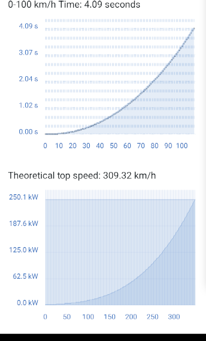
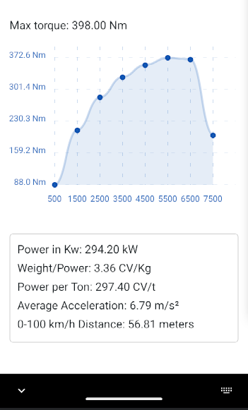

#  
# VirtualDyno

## Screenshot (development phase, light/dark theme)
 
  

# 🇬🇧 EN 
## Description
VirtualDyno is an application for calculating the performance of a vehicle based on parameters such as power, weight, aerodynamic coefficient, and traction. It allows you to estimate the 0-100 km/h acceleration time, specific power, and average acceleration.

## Features
- Insert main vehicle data (CV, weight, efficiency, air density, Cd, Cr, frontal area, traction)
- Calculate vehicle performance
- Switch between Italian and English language
- Performance chart (under development)

## Technologies used
- **React Native** for mobile development
- **React Native Picker** for traction selection
- **react-i18next** for language management
- **react-native-chart-kit** for data visualization (in the future)

## Installation
1. Clone the repository:
```sh
git clone https://github.com/DevFoxxx/VirtualDyno.git
cd VirtualDyno
```
2. Install dependencies:
```sh
npm install
```
3. Run the app with Expo:
```sh
npx expo start
```
4. Choose to run the app on your Android emulator or a real device directly from the Expo developer tools.

## Available translations
- Italian
- English

## Contributions
If you want to contribute, you can create a pull request with your changes or report issues in the "Issues" section of the repository. We're currently looking for people willing to help with the following:

1. Bug fixing
2. Improving the graphics to make it more attractive
3. Creating a dataset to extract constants for improving certain calculations, such as the difference between AWD, FWD and RWD
4. Enhancing the physics of the functions to make them more realistic and simulative
5. Adding various inputs and outputs to enrich the app

This project aims to remain free and available for everyone.

## License
This project is distributed under the [MIT license](https://github.com/DevFoxxx/VirtualDyno/blob/main/LICENSE).

---
# 🇮🇹 IT
## Descrizione
VirtualDyno è un'applicazione per il calcolo delle prestazioni di un veicolo basata su parametri come potenza, peso, coefficiente aerodinamico e trazione. Permette di stimare il tempo di accelerazione 0-100 km/h, la potenza specifica e l'accelerazione media.

## Funzionalità
- Inserimento dei dati principali del veicolo (CV, peso, efficienza, densità dell'aria, Cd, Cr, area frontale, trazione)
- Calcolo delle prestazioni del veicolo
- Cambio lingua tra Italiano e Inglese tramite uno switch
- Grafico delle prestazioni (in fase di sviluppo)

## Tecnologie utilizzate
- **React Native** per lo sviluppo mobile
- **React Native Picker** per la selezione della trazione
- **react-i18next** per la gestione delle lingue
- **react-native-chart-kit** per la visualizzazione dei dati (in futuro)

## Installazione
1. Clona il repository:
   ```sh
   git clone https://github.com/DevFoxxx/VirtualDyno.git
   cd VirtualDyno
   ```
2. Installa le dipendenze:
   ```sh
   npm install
   ```
3. Avvia l'app con Expo:
   ```sh
   npx expo start
   ```
4. Seleziona l'opzione per avviare l'app sul tuo emulatore Android o su un dispositivo reale direttamente dagli strumenti di sviluppo Expo.

## Traduzioni disponibili
- Italiano
- Inglese

## Contributi
Se vuoi contribuire, puoi creare una pull request con le tue modifiche o segnalare problemi nella sezione "Issues" del repository. Siamo attualmente alla ricerca di persone disposte ad aiutare con i seguenti aspetti:

1. Correzione di bug
2. Miglioramento della grafica per renderla più attraente
3. Creazione di un dataset da cui estrarre costanti per migliorare certi calcoli, come la differenza tra AWD, FWD e RWD
4. Miglioramento della fisica delle funzioni rendendole più realistiche e simulative
5. Aggiunta di vari input e output per arricchire l'app

Questo progetto mira a rimanere gratuito e disponibile per tutti.

## Licenza
Questo progetto è distribuito sotto la [licenza MIT](https://github.com/DevFoxxx/VirtualDyno/blob/main/LICENSE).
